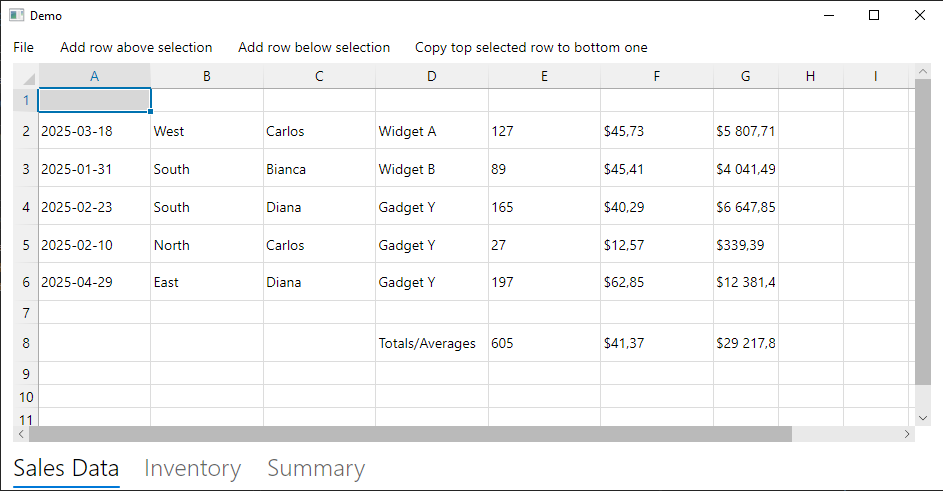

# Spreadalonia: a spreadsheet control for Avalonia

[](https://www.gnu.org/licenses/lgpl-3.0)
[](https://nuget.org/packages/Spreadalonia)

**Spreadalonia** is a library providing a simple spreadsheet control for Avalonia, with support for some basic Excel features.

The library is released under the [LGPLv3](https://www.gnu.org/licenses/lgpl-3.0.html) licence.

<p align="center">
    
</p>

https://github.com/user-attachments/assets/ee251316-fcdb-4e5a-b441-327e0edd6b72

## Getting started

The library targets .NET Standard 2.0, thus it can be used in projects that target .NET Standard 2.0+ and .NET Core 2.0+. The latest version supports Avalonia 11, versions up to 1.0.4 support Avalonia 0.10.

To use the library in your project, you should install the [Spreadalonia Nuget package](https://www.nuget.org/packages/Spreadalonia/). The library provides the `Spreadalonia.Spreadsheet` control, which you can include in an Avalonia `Window`.

This repository also contains a very simple demo projects, containing a window with a spreadsheet control.

Note: nuget package is not up to date. Build from sources to use Excel-like and other new features.

## Usage

See Demo project. You will need to add the relevant `using` directive (in C# code) or the XML namespace (in the XAML code). You can then add the `Spreadsheet` controls from the Spreadalonia namespace. For example

```XAML
<Window ...
        xmlns:spreadalonia="clr-namespace:Spreadalonia;assembly=Spreadalonia">
  ...
    <spreadalonia:Spreadsheet></spreadalonia:Spreadsheet>
  ...
</Window>
```

### Features

The spreadsheet implements the following features:

* Cell value editing
* Keyboard navigation and shortcuts
* Row/column resizing and AutoFit
* Context menu
* Copy, cut and paste
* Auto fill
* Moving cells/columns around
* Inserting and deleting rows and columns
* Undo/redo
* Preview for cells containing colour values
* Load xlsx file.
* Emulate Excel-like workbook.
* Calculate formulas and update their values on user actions.


## Source code

The source code for the library is available in this repository. In addition to the `Spreadalonia` library project, the repository contains a demo application.
